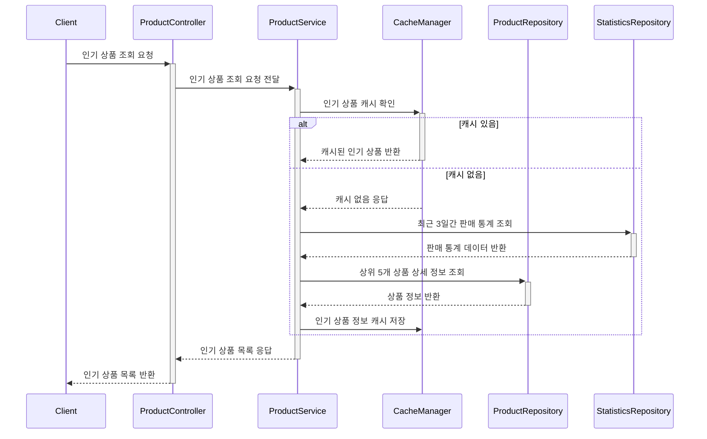

> ## 인기 상품 조회 프로세스
> 
> 인기 상품 조회는 최근 3일간의 판매 데이터를 기준으로 상위 5개 상품을 조회한다.
조회 성능을 위해 캐싱을 적용하며, 캐시 미스 시에는 통계를 집계하고 상품 상세 정보를 불러온 뒤 캐시 저장한다.
통계는 별도 저장소(예: Redis Sorted Set, RDB 집계 테이블 등)에서 조회할 수 있도록 분리 설계한다.
>
> ### 설계 배경
> 
>스니커즈 이커머스 특성상 트렌디한 상품은 빠르게 품절되며, 인기 상품 정보는 유저 구매 결정에 영향을 준다.
따라서 인기 상품 조회는 실시간성보다는 응답 속도와 캐시 활용 효율을 우선으로 두었고,
집계 시점은 비동기 배치나 이벤트 기반 통계를 활용할 수 있도록 확장 가능성을 고려했다.
> 
> ### 요약
> 최근 3일간의 판매 데이터를 기준으로 상위 5개의 인기 상품을 선정하여 제공한다.
우선 캐시에서 확인하고, 없을 경우 판매 통계 데이터를 집계하여 상품 정보를 조회한 뒤 캐싱한다.
이를 통해 통계 연산 비용을 줄이며, 캐시 만료 정책을 활용해 데이터 최신성을 유지한다.

