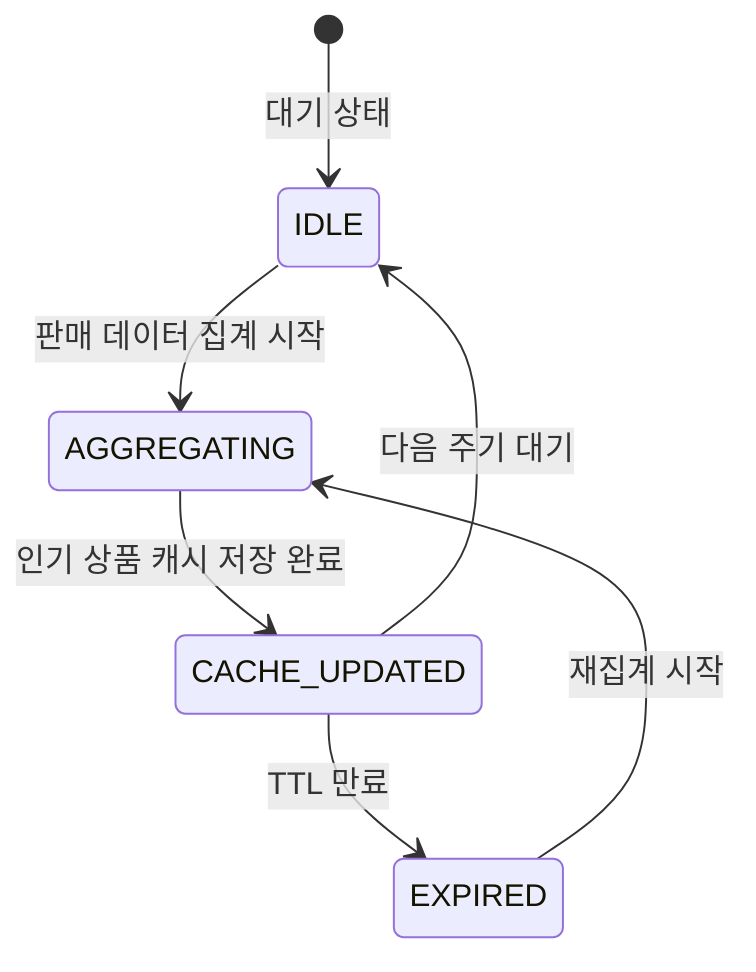

> ### 설명 
> 인기 상품 통계는 집계 → 캐싱 → 만료 → 재집계의 순환 구조로 운영되며,
배치 또는 이벤트 기반으로 통계 생성 및 캐시 동기화를 수행한다.

```mermaid
stateDiagram-v2
    [*] --> IDLE: 대기 상태
    IDLE --> AGGREGATING: 판매 데이터 집계 시작
    AGGREGATING --> CACHE_UPDATED: 인기 상품 캐시 저장 완료
    CACHE_UPDATED --> IDLE: 다음 주기 대기
    CACHE_UPDATED --> EXPIRED: TTL 만료
    EXPIRED --> AGGREGATING: 재집계 시작
```
